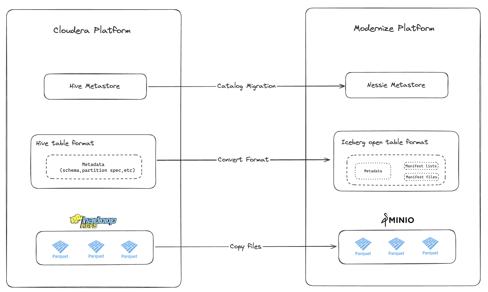

# Migration from Hadoop Architecture to Modernized Architecture with Iceberg


### Introduction :

This repository contains a step-by-step guide for migrating from a traditional Hadoop architecture to a modernized architecture using Apache Iceberg. The migration process involves three main steps:


<p align="center">
    
</p>

1.  Transferring files from HDFS to S3.
2.  Converting Hive tables to Iceberg tables.
3.  Migrating the catalog from Hive Metastore to Nessie.


By following this guide, you will be able to leverage the benefits of Iceberg,


## Table of Contents

- [Introduction](#Introduction)
- [Prerequisites](#Prerequisites)
- [Transferring_Files_from_HDFS_to_S3](#Transferring_Files_from_HDFS_to_S3)
- [Converting_Hive_Tables_to_Iceberg_Tables](#Converting_Hive_Tables_to_Iceberg_Tables)
- [Migrating_the_Catalog_from_Hive_Metastore_to_Nessie](#Migrating_the_Catalog_from_Hive_Metastore_to_Nessie)
- [Conclusion](#Conclusion)

## Prerequisites 

- Hadoop cluster with Hive tables and files (Parquet/ORC) in HDFS
- MinIO instance (or any S3-compatible storage)
- Spark notebook 
- Nessie instance

## Step 1: Transferring_Files_from_HDFS_to_S3

1. Copy files from HDFS to S3: 
    
   Copy the parquet/orc file of your table from hdfs to the target bucket using this command :

``` sh
   hadoop distcp hdfs://namenode:8020/path/to/hdfs/directory s3a://your-bucket/path/
```

2. Update Hive table location:

Once the files are copied to S3, update the location of your Hive tables to point to the new S3 location. Connect to your Hive metastore and run the following command:

``` sh
   ALTER TABLE your_table SET LOCATION 's3a://your-bucket/path/';
```

## Step 2: Converting_Hive_Tables_to_Iceberg_Tables

For a detailed explanation of this step, refer to the [notebook](/notebook/Migration_hive_iceberg.ipynb) included in this repository.


## Step 3: Migrating_the_Catalog_from_Hive_Metastore_to_Nessie

There are a few scenarios when you want to migrate your existing Apache Iceberg tables from one particular catalog to another, To attend this objectif we use a new command-line tool called [iceberg-catalog-migrator](https://github.com/projectnessie/iceberg-catalog-migrator). It enables bulk migration of Apache Iceberg tables from one catalog to another without the need to copy data. The tool supports all of the commonly used catalogs in Apache Iceberg, such as AWS Glue, Nessie, Dremio Arctic, Hadoop, Hive, REST, JDBC and any custom catalogs. 

In our scenario we use the command register to allows us to register Iceberg tables from source to the target catalog without making data copies, and the hive metastore as a source and nessie as a target catalog.


## Conclusion :


